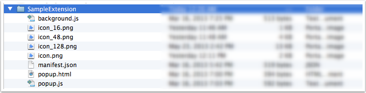

Let's delve deeper into the architecture and technical details of extensions in Opera. 

## The NEX Format
Opera supports the *NEX* file format for extensions. All the files and folders for an extensions are packaged into a zip file and renamed as *.NEX*. The NEX format will support a major portion of chromium extensions as well as a few APIs specific to Opera. We've created an list where we details which APIs from the chromium project we support, as well as which ones are exclusive to Opera.

The APIs from the chromium project supported in NEX extensions (like tabs) can be called using *chrome.\**, whereas the ones specific to Opera (like speed dials) will reside under the *opr.\** object. 

It is important to note that Opera will run extensions in the CRX format too, as long as the extension uses the chrome.* APIs which Opera also supports. 

However, we would *strongly* recommend extension authors to make Opera extensions in the NEX file format. 

## Types of extensions

Currently, there are four types of extensions in Opera.

#### 1. Extensions involving Browser Actions (and Page actions)
You can use Browser Actions or Page Actions to put UI elements in the browser window. Browser Actions are used to put UI elements in the top right side of the browser *next* to the address bar. This is different from Page Actions which are used to place a UI element *inside* the address bar. 

Page actions are used to put a UI element specific to just a page or a limited set of pages fitting a certain criteria. If you would like the UI element to be there for all pages, then you should use Browser Actions for that purpose. The UI elements you can use are buttons, badges and popups. To know more on how to create and use these in extensions, please read the article on [creating buttons, badges and popups](tut_browser_actions.html). 

#### 2. Context Menu extensions
As the name implies, they are extenions to the context menu of the page. You can bring up the context menu by either right-clicking an element in the page, or by using the appropriate shortcuts using your keyboard (varies according to your platform). We've created an article on [how to create context menu extensions](tut_context_menus.html). 

#### 3. Speed Dial extensions
You can also create extensions on the Speed Dial in Opera. Keep in mind that to create speed dial extensions, you need to use the *opr* object, and will only run in an NEX file extension. Go ahead and check out [how to create speed dial extensions](tut_speeddial.html).
#### 4. Extensions with no UI
You can also create extensions which don't have any UI component. If you are familiar with injected scripts in previous (presto based) versions of Opera, or with greasemonkey scripts, then you get the idea. 

An example of this could be an extension which listens to certain keyboard inputs, and performs an action (like opening a certain page in a new tab) when that keybaord shortcut is typed by the user. These extensions will work as part of the content script, which will be discussed (along with others parts of an extension) in the next part of this article.

## Different parts of an extension

#### The Extensions manifest 
The extension manifest files provides basic information like the name of the extension and the author, etc, as well as some important information like the APIs the extensions wants to access, which is listed in the *permissions* field. To know more about the extension manifest, [read the article](tut_manifest_explanation.html) on it. 

#### The Background Process 
You need a process to run in the background to co-ordinate some tasks or to maintain a certain state. You have two variants of it - The *Background Page* or *Event Page*. 

Though you can use an html page and put javascript inside the `<script>` tag, it usually better to just use a .js file and mention that in the manifest file. The browser will automatically generally the corresponding page for it. For example, 

<pre class="prettyprint">{
  ...
  "scripts": ["background.js"],
  ...
}</pre>

To specify an event page in the manifest file, you need to define the *persistent* feild as *false* like so:

<pre class="prettyprint">{
  ...
  "scripts": ["eventPage.js"],
  "persistent": false
  ...
}</pre>

The background page (or the background script) is essential for the user interface. Any peice of code which requires adding a UI item to the browser needs to be defined here. It is also the one responsible for noticing a change in state and updating or otherwise modifying the UI accordingly. 

Event pages are exactly like background pages, except that they only loaded when required. This means while the event page isn't loaded, system memory and resources are not being used, thus giving better performance. Extensions authors are recommended to use event pages whereever they can.

Event pages are loaded when: 

- The extension is installed, restarted started or updated to a new version.
- An event is dispatched which the event page was listening for. 
- When another part of the extension (like a popup) calls it (for example, using `runtime.getBackgroundPage`). 
- When another part of the extension sends a message (using `runtime.sendMessage()` or using long-lived connections. You can read more on message passing in our [article](tut_message_passing.html)).

#### The Content Script
If you want to make any change to the web page itself, then you need to use a content script. The content script has access to the DOM of the web page, but access to variables and functions is confined to only itself. For example, content scripts cannot access variables defined in the web page, or even in other content scripts. 

The content script does not have *direct* access to the variables and functions in the background scripts too. The same applies for access to API functions. However, you can use [message passing](tut_message_passing.html) to communicate between various parts of the extensions, be it background scripts or popups. So, say, you could call your functions in the background script and then communicate to the content script to do a certain task involving the web page DOM.

More details on it can be found in our [article on content scripts](tut_content_scripts.html).

#### The Popup Page
Sometimes extensions will have a popup which, well, pops up when you click an extension button. This is defined by an html page, and needs to be specified in the manifest. Read the [buttons, badges and popups](tut_browser_actions.html) article to learn more. 

#### The Options Page
If your extension needs a lot to store a user preferences then you should create an options page. If you define an options page then a link will be provided at the *extensions management* page from where the user can access the page. You need to declare it in the manifest like so:

<pre class="prettyprint">{
  ...
  "options_page": "options_page.html",
  ...
}</pre>

You can use *localStorage* as defined in the [Web Storage API](http://www.w3.org/TR/webstorage/) to store user preferences for the extension.

#### Icons and other files
Your extensions needs an icon, which should be --insert icon file size--. Apart from the icon, you might also need other files like images, fonts etc. as well as CSS and JS files for pages like the popup pages etc. 

## Files and Folder Structure

The above screenshot represents the folder structure of a typical extension. To make things more organized, you could also put images, fonts and other media in a  folder called *media*, stylsheets in a *css* folder and JS files in a *scripts* folder. 

You can refer to any of your files in your extensions using relative URLs. For example : `"`. An absolute URL to your extension resource can be received by accessing `chrome-extension://<extensionID>/<pathToFile>`. 

## How different parts interact

## APIs supported
Opera supports a certain subset of chrome.\* APIs found in the chromium project, as well as a few APIs exclusive to Opera which are under the *opr* object. The *opr*.\* APIs we support are:

- The Speed Dial API

With time, we will be adding more APIs to the *opr* object. 

The *chrome.\** APIs supported in Opera are:

- alarms
- browserAction
- declarativeWebRequest
- extension
- internationalization
- idle
- management
- pageAction
- permissions
- runtime
- scriptBadge
- storage
- tabs
- webRequest
- windows