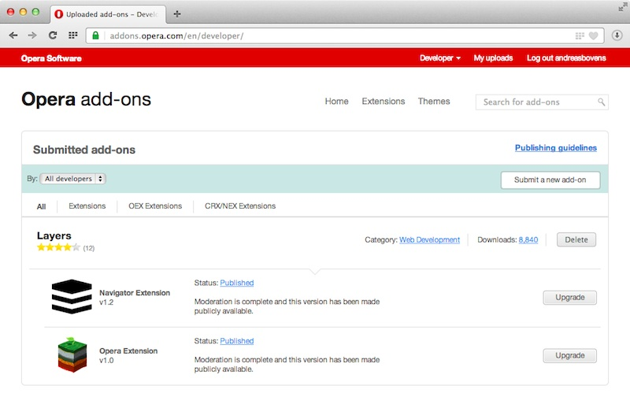

## Introduction

If you have created extensions for Opera 11 and 12 (OEX format), we recommend you to convert them for our Chromium-based Opera 15 browser (NEX/CRX format). Doing this is a straightforward process, and we've built some cool tools that you can use to automate most of the conversion process. This tutorial covers step-by-step how to proceed.

Note: if you have already created a CRX extension by yourself, and you want to use that rather than our conversion tool, start from [Publishing the upgrade in the catalog](#publishing_the_upgrade_in_the_catalog).

## The green *Convert* button

If you have previously submitted an OEX extension to the extensions catalog, and it's been approved, the developer interface will look like the screenshot below. As a first step of the OEX-to-NEX/CRX conversion process, click the green *Convert* button.

Your extension then will be converted on the fly, and you'll get a download prompt for a ZIP package, which contains your converted extension. 

Unpack this ZIP file, and have a peek inside: you'll recognize your original folder structure and files, a *manifest.json* file based on what used to be *config.xml*, and an *oex_shim* folder with some spectacular JavaScript in it that maps our old OEX API to the Chromium extension API.

## Try out the converted extension

Start Opera 15, and go to *opera:extensions* in the address bar. Click on *Developer Mode*, and then on *Load Unpacked Extension...*. Point the file picker to the folder we've unpacked in the previous step.

You should then try out the extension and fix what's broken. As you can see in the screenshot above, the extension icon of my converted Layers extension turned out a little too small, and also the version number needs a change.

The screenshot above shows what the extension looks like after changing the extension icon and version number. You can hit the *Reload* button for reloading, or simply load your edited version as a new extension (which is what I've done here).

## Time to pack

Once you're happy with the result, click the *Pack Extension* button and browse to the extension's root directory. The Private key file field is optional.

When you click *Pack Extension*, you should see the dialog below. There's a NEX file generated as well as a PEM key file. You'll need the PEM key to create new versions in the future, so don't lose it. Click OK.

## Publishing the upgrade in the catalog 

Go to <a href="http://addons.opera.com/developer/">the extension's catalog developer interface</a> and click the *Upgrade* button of the OEX extension you want to upgrade.

Click on Choose File and select the NEX file you've created, as shown below. Then, click on *Save and continue*.

Fill out the required fields with meta data, upload screenshots and double check if everything is as it should be.

When you're done, you submit the extension, and it's pushed to our review queue. Our extension reviewers will look at it, and once they approve the extension, it will appear in our extensions catalog.

In the developer interface (shown above), you'll see that two extension "streams" appear: one for OEX, which is only shown to Opera 11 and 12, and one for NEX/CRX, which is shown to Opera 15+.