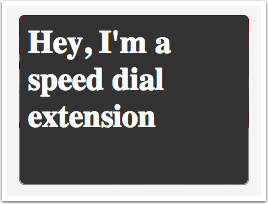
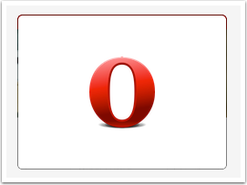

## The Speed Dial

Back in 2007 we introduced the concept of the *speed dial* to browsers. It has since turned out to be a hugely popular feature, so it makes sense to give extension authors the ability to add to it by giving them the ability to make speed dial extensions.

Speed dial extensions use the *opr.\** APIs instead of the *chrome.\** ones. Also, they need to be packaged in *.nex* format - if they are is any other format (including *.crx* they will not run).  

## Specifying it in the manifest

The first thing to do is to specify in the manifest that you want the extension to be a speed dial extension. First you'll need to mention "speeddial" in the "permissions" feild. You also need to mention the speed dial page, which will also act as your background page. Another thing to note is that speed dial extensions, do *not* have permission to create other UI elements like a button or a popup etc.

There is also a "speeddial" feild in which you need to specify the title of the speed dial and the URL to which it will point to, like so:

<pre class="prettyprint">{
  "name": "Speed Dial Extension",
  "developer": "John Doe",
  ...
  "permissions": ["speeddial"],
  "background": {"page": "speeddial.html"},
  "speeddial": {
    "title": "Sample Speeddial",
    "url": "http://www.opera.com"
    }
    ...
}</pre>

**Note**: Opera will take string described in the "name" feild of the manifest and use it as the title of the speed dial extension. You can of course then change the title using javascript, which is described later on in this article. 

## The speed dial page
The speed dial page itself is just an html page, which will be displayed in the speed dial cell. A speed dial cell is 228px in width and 168px in height. Lets take an example speed dial extension, and see the html associated html page. 

<pre class="prettyprint">&lt;html&gt;
&lt;head&gt;
	&lt;style&gt;
		body{
			background-color:  #333;
			color: #fff;
		}
	&lt;/style&gt;
&lt;/head&gt;

&lt;body&gt;
	&lt;h1&gt;Hey, I&#39;m a speed dial extension&lt;/h1&gt;
&lt;/body&gt;
&lt;/html&gt;</pre>

This will result in a speed dial extension which would look like the one below: 

Note that the text is there, but is in the top-left corner of the page. Let's see how to change that so that elements can center nicely in the speed dial cell.

## Centering elements in the speed dial

One of the most common things in a speed dial is to place an element (whether its some peice of text or some image) in the center of the speed dial. Since speed dial pages are just normal html pages, you can use css to do this. Previous ways to center content were a bit hard to do if you wanted the content to be centered both vertically and horizontally.

However, with CSS flexbox, its possible to do it very easily. Use `align-items: center` to center the content vertically and `justify-content: center` to do it horizontally. For now, we would also like you to include use flexboxes with prefixes as well as the standard version - this would allow the effect to work currently (using prefixes) and makes sure that will work in the future too (when flexbox is unprefixed, in which case, the unprefixed version will apply).

An example of such an implementation is below:

<pre class="prettyprint">&lt;html&gt;
&lt;head&gt;
	&lt;style&gt;
		body{
			display: -webkit-flex;
			display: flex;
			-webkit-align-items: center;
			align-items: center;
			-webkit-justify-content: center;
			justify-content: center;
		}
	&lt;/style&gt;
&lt;/head&gt;

&lt;body&gt;
&lt;div id=&quot;cont&quot;&gt;
	&lt;img src=&quot;Opera-icon-low-res.png&quot; alt=&quot;Opera Icon&quot; /&gt;
&lt;/div&gt;
&lt;/body&gt;
&lt;/html&gt;</pre>

Which will result in the image being positioned like so:

If you are not familiar with Flexbox, you can learn more about it by reading Chris Mill's great [introductory flexbox article](http://dev.opera.com/articles/view/flexbox-basics/), and then go on for a more [advanced article](http://dev.opera.com/articles/view/advanced-cross-browser-flexbox/) too.

## Use JavaScript to enhance your extension

You can access the speed dial functions using javacript by using the *opr.speeddial.\** APIs. Your JS code can be simply be linked from the speed dial page, for example 

<pre class="">..
&lt;script src=&quot;sd.js&quot; type=&quot;text/javascript&quot;&gt;&lt;/script&gt;
...</pre>

The most common things to do with a speed dial in an extension would be to 

1. Get details like the title and the URL of the speed dial.
2. To update the title and URL to something different. 

For the former, you need to use the `get()` variable. A callback is triggered which gives you the required details. For example, 

<pre class="prettyprint">opr.speeddial.get(function(result) { 
console.log("The URL is: " + result.url + " and the title is " + result.title); 
});</pre>

To update the speed dial extenion, you simply use the `update()` function. For example

<pre class="prettyprint">opr.speeddial.update({ url: "http://dev.opera.com", title: "Dev Opera" });</pre>

Feel free to [download our sample speed dial extension](http://sample.com/sample.htm) and have a look around the code. 